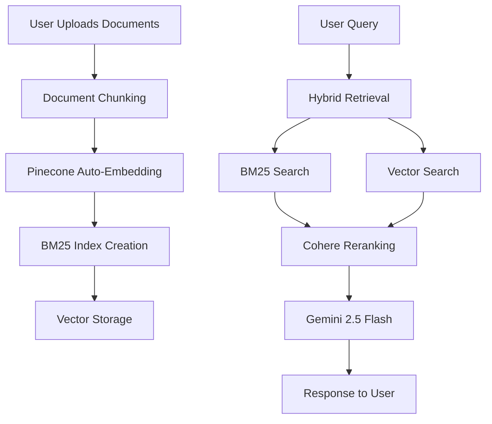

# 🚀 ScalableRAG – Advanced RAG Chatbot with Document Upload

**ScalableRAG** is a production-ready Retrieval-Augmented Generation (RAG) chatbot that combines hybrid search, reranking, and modern LLMs for accurate, intelligent responses. Features document upload, automatic indexing, and a clean web interface.

> ⚡ **Fast & Efficient**: Sub-2 second response times  
> 📚 **Multi-format Support**: PDF, TXT, DOC, DOCX documents  
> 🧠 **Hybrid Search**: Vector + keyword search with reranking  
> 🔄 **Auto-indexing**: Upload documents and get instant responses  

---

## 🧩 Key Features

- 🔍 **Hybrid Retrieval**: Combines Pinecone vector search with BM25 keyword search
- 🧠 **Cohere Reranking**: Boosts relevance using Cohere's `rerank-english-v3.0` API
- 📦 **Pinecone Integration**: Cloud-based vector database with `llama-text-embed-v2` embeddings
- 🤖 **Google Gemini 2.5 Flash**: Fast, accurate LLM for response generation
- 📄 **Document Upload**: Multi-file support with automatic indexing
- ⚡ **Optimized Performance**: Parallel processing and efficient caching
- 🌐 **Modern Frontend**: Clean HTML/CSS/JS interface with real-time chat
- 🔐 **Secure**: Environment-based API key management
- 🚀 **Easy Deployment**: Simple FastAPI backend with `uv` package management

---

## 📁 Project Structure

```
ScalableRAG/
├── rag_app/
│   ├── main.py              # FastAPI application with upload/query endpoints
│   └── pipeline.py          # Core RAG logic: retrievers, reranker, LLM chain
├── load_index/
│   └── make.py              # Document ingestion and indexing script
├── templates/
│   └── chatbot.html         # Modern chat interface with file upload
├── uploads/                 # Temporary storage for uploaded documents
├── requirements.txt         # Python dependencies
├── pyproject.toml          # UV project configuration
├── run_server.py           # Easy server startup script
└── .env                    # API keys (create this file)
```

---

## 🚀 Quick Start

### 1. Clone and Setup

```bash
git clone <your-repo-url>
cd ScalableRAG-main
```

### 2. Install Dependencies

```bash
# Using uv (recommended)
uv sync

# Or using pip
pip install -r requirements.txt
```

### 3. Environment Configuration

Create a `.env` file in the root directory:

```env
# Required API Keys
PINECONE_API_KEY=your-pinecone-api-key
PINECONE_INDEX_NAME=your-index-name
COHERE_API_KEY=your-cohere-api-key
GEMINI_API_KEY=your-gemini-api-key
```

### 4. Run the Application

```bash
# Start the server
python run_server.py

# Or manually
uv run --directory rag_app uvicorn main:app --reload --host 0.0.0.0 --port 8000
```

### 5. Access the Chatbot

Open your browser and go to: **http://localhost:8000**

---

## 🎯 How to Use

### Document Upload & Indexing

1. **Upload Documents**: Select multiple files (PDF, TXT, DOC, DOCX)
2. **Automatic Processing**: The system automatically:
   - Chunks your documents
   - Generates embeddings using Pinecone's `llama-text-embed-v2`
   - Creates BM25 keyword index
   - Uploads vectors to Pinecone
3. **Ready to Chat**: Start asking questions about your documents

### Chat Interface

- **Ask Questions**: Type any question about your uploaded documents
- **Real-time Responses**: Get intelligent answers powered by Gemini 2.5 Flash
- **Context-Aware**: Responses are based on your specific document content

---

## ⚙️ How It Works



### Technical Flow

1. **Document Processing**: Documents are chunked and embedded using Pinecone's integrated `llama-text-embed-v2` model
2. **Hybrid Retrieval**: Queries use both BM25 (keyword) and Pinecone (semantic) search
3. **Reranking**: Cohere's reranker improves relevance by reordering results
4. **Generation**: Google Gemini 2.5 Flash generates contextual responses
5. **Response**: Clean, accurate answers delivered to the user interface

---

## 🛠️ Technology Stack

| Component | Technology |
|-----------|------------|
| **Backend** | FastAPI |
| **Frontend** | HTML/CSS/JavaScript |
| **Vector Database** | Pinecone (cloud) |
| **Embeddings** | Pinecone `llama-text-embed-v2` |
| **Keyword Search** | BM25 (local) |
| **LLM** | Google Gemini 2.5 Flash |
| **Reranking** | Cohere `rerank-english-v3.0` |
| **Framework** | LangChain |
| **Package Manager** | UV |
| **Deployment** | Local/Cloud ready |

---

## 📊 Performance Features

- **Fast Response Times**: Sub-2 second query responses
- **Efficient Indexing**: Automatic embedding generation by Pinecone
- **Scalable Architecture**: Handles multiple documents and concurrent users
- **Memory Efficient**: Optimized chunking and caching strategies
- **Real-time Processing**: Live document upload and indexing

---

## 🔧 API Endpoints

- `GET /` - Chatbot interface
- `POST /upload-and-index` - Upload and process documents
- `POST /query` - Query the RAG system
- `GET /health` - Health check

---

## 🚀 Deployment Options

### Local Development
```bash
python run_server.py
```

### Production Deployment
- **Railway**: Easy cloud deployment
- **Docker**: Containerized deployment
- **AWS/GCP**: Cloud infrastructure
- **Heroku**: Simple web deployment

---

## 📝 Environment Variables

| Variable | Description | Required |
|----------|-------------|----------|
| `PINECONE_API_KEY` | Pinecone API key | ✅ |
| `PINECONE_INDEX_NAME` | Pinecone index name | ✅ |
| `COHERE_API_KEY` | Cohere API key | ✅ |
| `GEMINI_API_KEY` | Google Gemini API key | ✅ |

---

## 🤝 Contributing

1. Fork the repository
2. Create a feature branch
3. Make your changes
4. Test thoroughly
5. Submit a pull request

---

## 📄 License

This project is open source and available under the [MIT License](LICENSE).

---

## 🆘 Support

- **Issues**: Report bugs and request features via GitHub Issues
- **Documentation**: Check this README for setup and usage instructions
- **Community**: Join discussions in the repository

---

**Built with ❤️ for intelligent document processing and retrieval-augmented generation.**